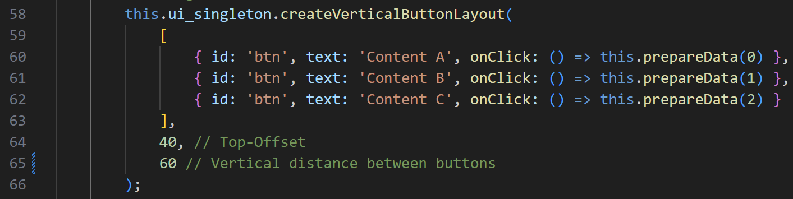

# SamplesFromHostileToHospitable
Generalized Web Augmented Reality (WebAR) features from the app From Hostile To Hospitable

## Table of Contents
- [Installation](#installation)
- [Usage](#usage)
- [Features](#features)
- [Customize](#customize)
- [Publish](#publish)
- [Contributing](#contributing)
- [License](#license)

## Installation
1. Clone the repository:
   ```bash
   git clone https://github.com/FKI-HTW/SamplesFromHostileToHospitable
2. Install dependencies:
    ```bash
    npm install
3. Start the development server:
    ```bash
    npm run dev
4. Build for production:
    ```bash
    npm run build
## Usage
After starting the app, navigate to `http://localhost:5173/` in your browser. <br>
Use the Chrome Browser. To Debug with Android Smartphone go to `chrome://inspect/#devices`
## Features
- Define 3D models and audios in json database
- Select desired content in start screen
- Place 3D content in WebAR with hit testing on found planes
- Experience different contents with timeline feature
## Customize
To add your custom content you can modify the following files:
### database.json
    Link custom models (glb or gltf format) and audios (mp3|wav|m4a format) with this structure:
    {
        "ID": 0,
        "contentName": "Spot 0",
        "pathModel": "assets/models/ladybug.glb",
        "pathAudioFiles": [
            {
                "path": "assets/audios/test1.mp3",
                "time": 2
            },
            {
                "path": "assets/audios/test2.mp3",
                "time": 8
            }
        ]
    }
    The time corresponds to the start time to play the audio in the timeline
### GameScene.ts
To add and label a new button, adapt the following syntax. The :number argument in .prepareData relates to the content's position in database.json

## Publish
After making a build you get a /dist folder
Upload it to any server that supports HTTPS. <br>
[Netlify](https://app.netlify.com/) is for free.
## Contributing
Contributions are welcome! Follow these steps:
1. Fork the project.
2. Create a new branch (git checkout -b feature/NewFeature).
3. Commit your changes (git commit -m 'Add NewFeature').
4. Push to the branch (git push origin feature/NewFeature).
5. Open a Pull Request.
## License
This project is licensed under the MIT License.

